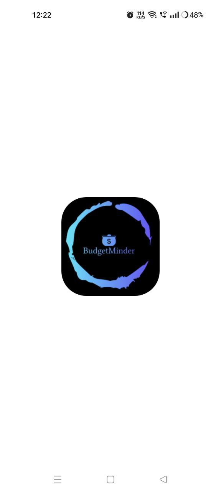
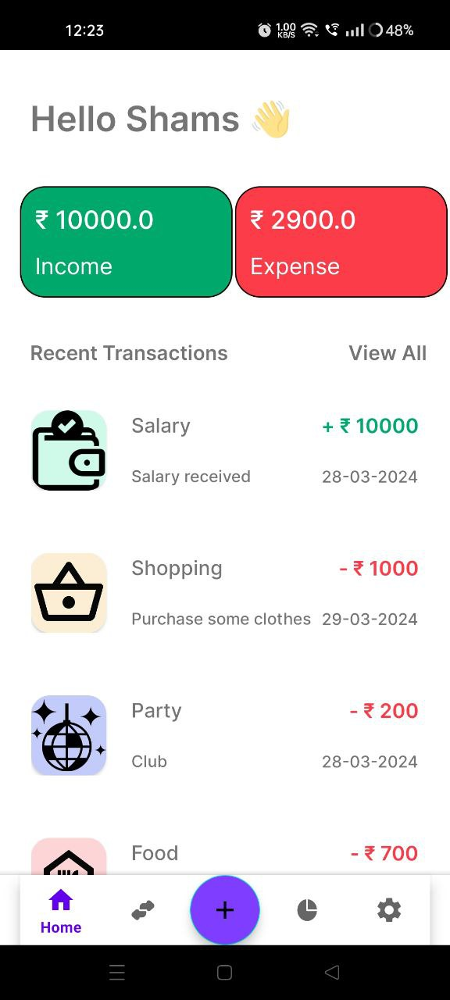
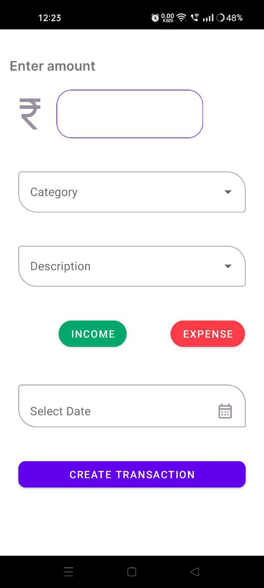
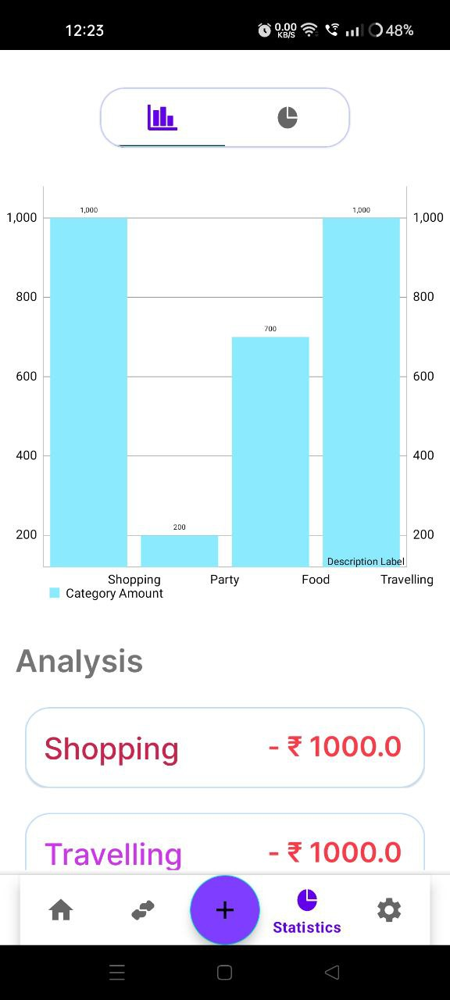

# BudgetMinder

Welcome to the BudgetMinder app repository! BudgetMinder is an Android application designed to help individuals keep track of their income and expenses efficiently. With its intuitive interface and powerful features, managing your finances has never been easier.

## Features

- **Income and Expense Tracking:** Keep track of your income and expenses effortlessly.
- **Statistics:** View statistics in pie graphs and bar graphs to visualize your financial data.
- **Transaction History:** List all transactions according to date, including Today, Yesterday, and earlier transactions.
- **Budget Management:** Set budgets and monitor your spending to stay on track financially.

## Screenshots

Here are some screenshots of the BudgetMinder app:

 

## Download

You can download the latest version of the BudgetMinder app from the link below:

[Download BudgetMinder App APK](#)

## Installation

To install the BudgetMinder app, follow these steps:

1. Download the APK file from the link provided above.
2. Open the downloaded file on your Android device.
3. Follow the on-screen instructions to install the app.
4. Once installed, you can start tracking your income and expenses and managing your budget effectively.

